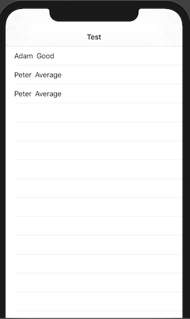

# Animated Bar Chart
---
### Picker with Segment Style 

### Add animation to the chart

### Using ZStack to add background

### Light and dark mode


### Dynamic list & Identifiable 
SwiftUI enables users to create dynamic views by using List or ForEach. However, SwiftUI requires an unique indentifier to identify those views, otherwise it doesn't know what has changed. This example is about to illustrate the problem when SwiftUI cannot find out the different in the list of dynamic views. 
```swift 
struct Student {
    let name: String
    let type: String
}
```
```swift
@State var students: [Student] = [
        Student(name: "Adam" , type: "Good"),
        Student(name: "Peter", type: "Average"),
        Student(name: "Peter", type: "Good"),
    ]
List {
        ForEach(students, id: \.name) { student in
            HStack {
                Text("\(student.name)")
                Text("\(student.type)")
            }
     }
    .onDelete(perform: deleteItem)
}
```
In the example above, we have a `Student` structure including two variable `name` and `type`. To create a dynamic view displaying the list of students, we use ForEach to go through the array `students`. Notice that we're using keypath `\.name` as an id for this list, which has led to a problem when two students has the same name, particularly in this example is Peter. 




