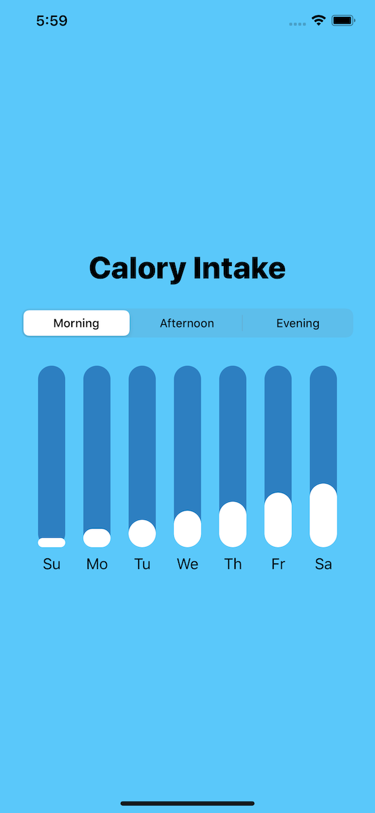

# Animated Bar Chart
---

This project follows the instruction from the video from Lets Build That App https://www.youtube.com/channel/UCuP2vJ6kRutQBfRmdcI92mA



### Picker with Segment Style 
In SwiftUI, you can easily add Picker with Segment Style to the UI by using
``` swift
@State private var pickerSelectedSystem = 0
Picker(selection: $pickerSelectedSystem.animation(), label: Text("")) {
            ForEach(DayParts.allCases) { day in
                Text(day.name).tag(day.rawValue)
            }
        }
        .pickerStyle(SegmentedPickerStyle())
```

A variable pickerSelectedItem was used to bind the data to the Picker. Whenever the user select a picker, the pickerSelectedItem will be updated accordingly. 

### Add animation to the chart
To add animation to the chart, I have called `$pickerSelectedSystem.animation()` to automatically animate when that variable changes.

Paul Hudson wrote on this tutorial https://www.hackingwithswift.com/books/ios-swiftui/animating-bindings

> These binding animations effectively turn the tables on implicit animations: rather than setting the animation on a view and implicitly animating it with a state change, we now set nothing on the view and explicitly animate it with a state change. In the former, the state change has no idea it will trigger an animation, and in the latter the view has no idea it will be animated – both work and both are important.

### Light and dark mode
Starting from iOS 13, the user can switch between light and dark mode. Once the user uses dark mode, the app will automatically change to the contrast color to adapt with the new theme. To update the background of the app according to the OS mode, Xcode 11 release a new atribute `Appearances` in `Assests.xcassets`, which enables developers to set the color based on the mode. 


### Dynamic list & Identifiable 
SwiftUI enables users to create dynamic views by using List or ForEach. However, SwiftUI requires an unique indentifier to identify those views, otherwise it doesn't know what has changed. This example is about to illustrate the problem when SwiftUI cannot find out the different in the list of dynamic views. 
```swift 
struct Student {
    let name: String
    let type: String
}
```
```swift
@State var students: [Student] = [
        Student(name: "Adam" , type: "Good"),
        Student(name: "Peter", type: "Average"),
        Student(name: "Peter", type: "Good"),
    ]
List {
        ForEach(students, id: \.name) { student in
            HStack {
                Text("\(student.name)")
                Text("\(student.type)")
            }
     }
    .onDelete(perform: deleteItem)
}

private func deleteItem(at indexSet: IndexSet) {
    students.remove(atOffsets: indexSet)
}
```
In the example above, we have a `Student` structure including two variable `name` and `type`. To create a dynamic view displaying the list of students, we use ForEach to go through the array `students`. Notice that we're using keypath `\.name` as an id for this list, which has led to a problem when two students has the same name, particularly in this example is Peter.


The UI displays the same student twice even though their type are different. Also, if you try to delete a `Peter` in the middle, it will delete the last row instead. The problem is because we told SwiftUI the wrong unique id. To solve the problem, we should create a universal unique identifier (UUID). Therefore, the code will look like this 
``` swift
struct Student {
    let id = UUID()
    let name: String
    let type: String
}
```
If we don't want to call `ForEach(students, id: \.id)`, we can conform the `Identifiable` protocol. 

``` swift
struct Student: Identifiable {
    let id = UUID()
    let name: String
    let type: String
}

ForEach(students) { student in
            HStack {
                Text("\(student.name)")
                Text("\(student.type)")
            }
    }
```


